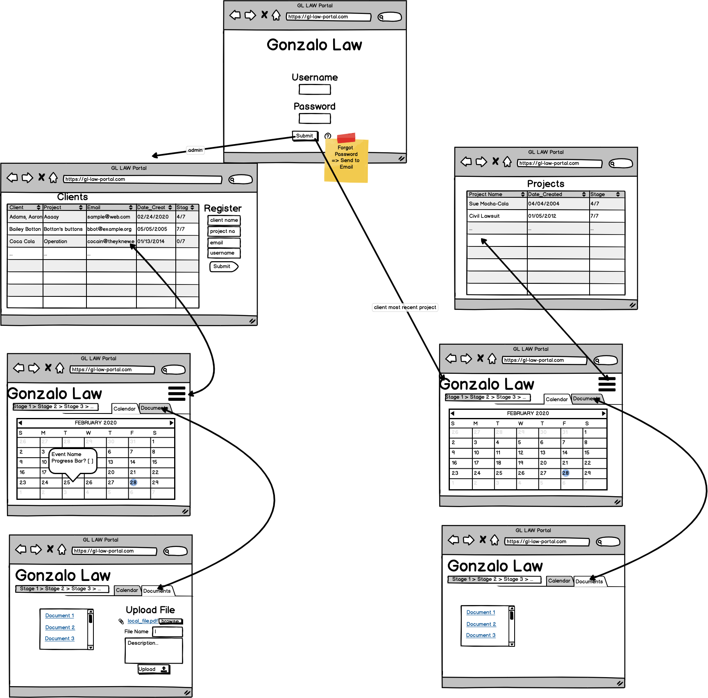
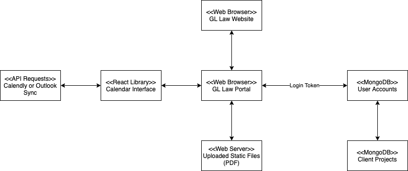
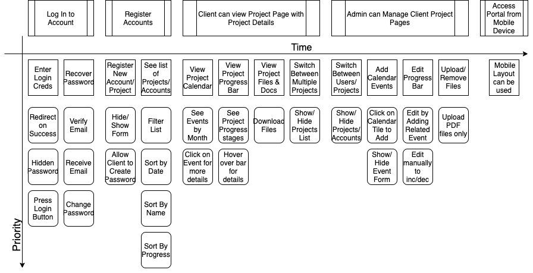

## [Admin Documentation](documentation/Admin_Info.md)
Please click the link above to view how to administrate the application.

# Application Wireframe


# System Context Model


# User Storyboard


This project was bootstrapped with [Create React App](https://github.com/facebook/create-react-app).

Instructions used to [add TypeScript to the project](https://create-react-app.dev/docs/adding-typescript/). Additional resources on using TypeScript on that page.

## Main Requested Features

### Progress Bar

Keeps track of progress on the current case. 

The Administrator, can choose whether to increment the bar or decrement.

Users can view but not change the status of the bar.

### Calendar

Allows for appointments to be schedules and saved on each user account.

When the calendar is synced with outlook, the calendar information will be visible from both our app and your own outlook calendar.

## Bonus Features

- Hashing for sensitive information
- Email Account Verification
- Email notifications
- Outlook Calendar Sync
- PDF File Upload/Download

# Getting Started

## Available Scripts

In the project directory, you can run:

### `npm run install-all`
Installs all dependencies for both the server and the client bases.

### `npm run dev`

Runs the app client and server in the development mode.<br />
Open [http://localhost:3000](http://localhost:3000) to view it in the browser.

The page will reload if you make edits.<br />
You will also see any lint errors in the console.

### `npm run start`

Run the app in production mode. <br />
Open [http://localhost:3000](http://localhost:3000) to view it in the browser.
Uses the build from react files and the server so no live changes are available.

### `npm run test`

Runs a few JEST Mock test, 

The majority of the test that we used involved postman.

### `npm run build`

Builds the react app for production to the `client\build` folder.

Builds	the server in the `server\dist` folder.<br />It correctly bundles React in production mode and optimizes the build for the best performance.


## Configuration

### Environment Variables

In order for the web app to run the server a few environment variables are required to be filled out in `.env` 

Keep in mind that the keys that have been used so far are personally owned by students and not suitable for production use. 

* The mongo DB uri -- DB_URI

* JSON Web Token Verification Secret -- JWT_SECRET

* Server Listening Port -- PORT

* Outlook Client ID - ID

* Outlook Secret - CLIENT_SECRET

* Mailgun API Key -- MAILGUN_API_KEY

* Mail GUN Domain Name -- FROM_EMAIL

  ```dotenv
  DB_URI=
  JWT_SECRET=randomsecret
  PORT=3001
  CLIENT_SECRET=
  ID=
  MAILGUN_API_KEY=
  FROM_EMAIL=sandboxrandom.mailgun.org
  ```
### Using the Site

Navigate to the site URL or if local use `npm run dev`

Navigation for the site itself is included in [Admin Info](documentation\Admin_Info.md).

## Documentation

Links to different aspects of the backend API

* [Users](documentation/Backend_Interaction.md)
* [Cases](documentation/Case_Router.md)
* [Email](documentation/Document_Router.md)
* [Documents](documentation/Document_Router.md)

  

