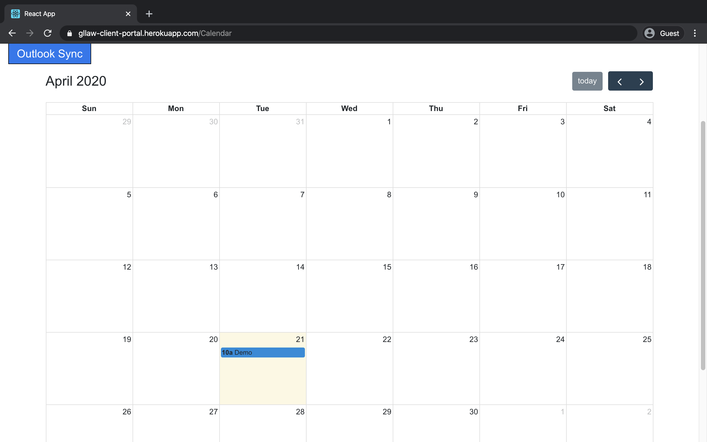
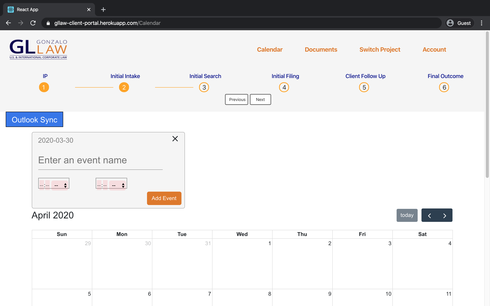
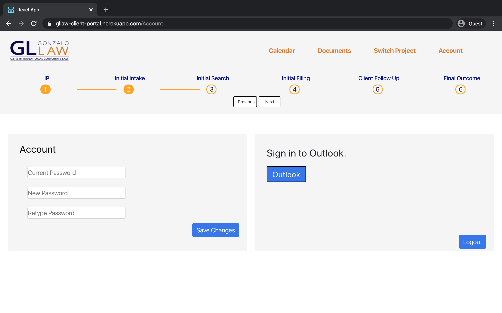

# GL Law Portal (Administrator)
Welcome to the Gonzalo Law Portal - Administration Tool. This guide will walk through how to administrate the portal and set it up for your clients to use.

## Log In

Just like a client, you will need to log into the portal with your admin credentials. The current admin credentials are:
username: jsmith
password: hunter12

## View All Projects

As an admin, you will be redirected to the list of all client projects upon successful login. You may click on any of these projects to be directed to that projects' calendar page. Additionally, you can use the filter box to filter through any of the fields in the table. Clients will see a similar page if they are involved in more than one project.
As an admin, you are able to register new users for an account and project. Only minor identification details are required, since the user will be able to determine their password upon their first login from the link sent to their email. Once the account has been created, the contents attached to that account can be edited like any other existing account.

## Manage Events with a Calendar

The Calendar tab is identical to the one that will be seen by the client. It can be used to review all the past and upcoming events related to the project, including when major stages were completed. An overview of the progress can be seen at all times throughout the application in the progress bar of the header.

### Adding an event

The main distinction between your view and a client's view of the calendar is that clicking on a tile in the calendar will allow you to register a new event through the pop-up at the top of the page.

## Upload Documents Online

The Documents tab allows you to upload documents for the client to see, or remove them from the project. You can also download the document yourself to review its contents. Clients will only be able to view and download the documents.

## Changing Account Details

The Account tab allows changes the password linked to your account. Clients will have access to a similar page for their accounts.